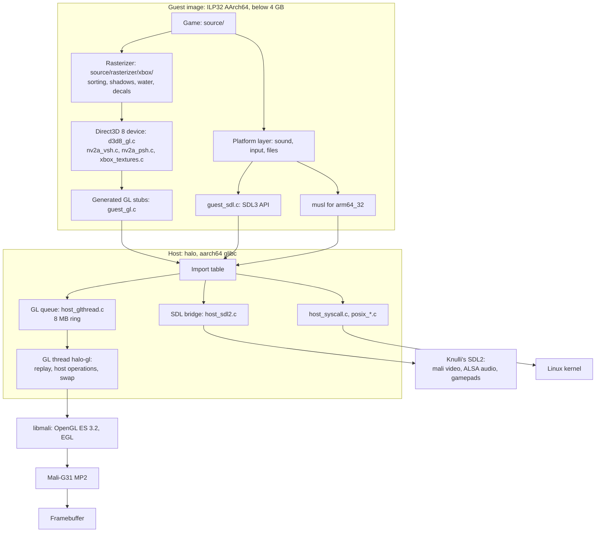

# Architecture of the Halo CE port for the RG35XX H

This is the developer's reference for how the native port of Halo: Combat
Evolved runs on the Anbernic RG35XX H and the other Allwinner H700
handhelds under Knulli. It follows the code from the start of the process
to a finished frame: the split between the game, compiled as an ILP32
AArch64 guest image, and the host program that loads it; the Knulli host,
which answers the guest's SDL3 calls with the firmware's SDL2; the GL thread,
which moves the Mali driver's work to another core; the Direct3D 8 renderer,
which translates the Xbox's graphics calls and shaders into OpenGL ES; and
the changes to the game's own rasterizer that suit a tile-based GPU.
[How it works](HOW-IT-WORKS.md) is the short overview. The measurements
behind the design are in [Performance](PERFORMANCE.md) and
[Mali-G31 notes](MALI-G31-NOTES.md), and the tools that took them are in
[Profiling](PROFILING.md).

File paths are relative to the upstream tree as `build.sh` prepares it
(`work/halo-ce-universal/`), unless they start with `port/knulli/`,
`patches/` or `tools/`, which are in this repository.

## Contents

- [The pieces](#the-pieces)
- [The guest and the host](#the-guest-and-the-host)
- [The Knulli host](#the-knulli-host)
- [The GL thread](#the-gl-thread)
- [The Direct3D 8 renderer on OpenGL ES](#the-direct3d-8-renderer-on-opengl-es)
- [Changes to the game's rasterizer](#changes-to-the-games-rasterizer)
- [Data flow](#data-flow)
- [Source map](#source-map)

## The pieces

| Location | Origin | Contents |
| --- | --- | --- |
| `source/` | upstream | The decompiled game (Xbox build 01.01.14.2342). The patch changes seven of its files for the Mali GPU. |
| `port/linux/src/` | upstream, patched | The platform layer shared by the native ports: Direct3D 8 on OpenGL (`d3d8_gl.c`), the shader translators (`nv2a_vsh.c`, `nv2a_psh.c`), texture decoding (`xbox_textures.c`), the settings (`port_config.c`), files, sound, input and network. |
| `port/android/guest/` | upstream | The guest runtime and a port of musl to the `arm64_32` ABI. |
| `port/android/host/` | upstream, patched | The Android host: the image loader, guest memory, threads, system calls and the GL helpers (`host_gl.c`). |
| `port/knulli/` | this repository | The Knulli host, the launcher and the profiling scripts. `build.sh` copies it into the upstream tree. |
| `patches/halo-ce-universal-knulli.patch` | this repository | The changes to upstream's files, and the port's new files inside upstream's directories, applied to the commit in `UPSTREAM_COMMIT`. |
| `tools/` | this repository | Benchmark scripts that drive the handheld over ADB ([tools/README.md](../tools/README.md)). |

The build produces two programs:

- `halo_guest.elf`: the game, the platform layer and the guest runtime, as
  upstream's Android build makes them. A static ILP32 AArch64 image.
- `halo`: the host, an ordinary aarch64 glibc executable. It loads the image,
  links it to the firmware's SDL2 and Arm's Mali driver, and runs it.

The patch's renderer and rasterizer changes are compiled where
`HALO_ANDROID` is defined. The guest image is the same for upstream's
Android app and for this port, so those changes apply to both; so do the
changes to `port/android/host/`. What only the handheld needs, such as the
GL thread, is in `port/knulli/`.

## The guest and the host

### Why the game is a guest image

Halo's data has the layout of the Xbox's memory. Its map (cache) files, its
saved games and its Direct3D resources hold 32-bit pointers and physical
addresses. Compiled with 64-bit pointers, every structure the game reads
from those files would change its layout. The upstream Android port
therefore compiles the game as ILP32 AArch64 code: 64-bit ARM instructions
with 32-bit `int`, `long` and pointers, running inside an ordinary 64-bit
process. This is native code. The Cortex-A53 cores execute the game's
instructions directly; nothing is translated or emulated.

### Building the image

clang's only ILP32 AArch64 target is Apple's `arm64_32`, so upstream's
`tools/android_build.py` builds the guest as follows:

1. clang (`clang-22` here) compiles the game, the platform layer and the
   runtime for `--target=arm64_32-apple-watchos`, with `-U__APPLE__`,
   `-U__MACH__` and `-fno-define-target-os-macros` to hide the Darwin
   environment, `-DHALO_ANDROID=1`, `-mcpu=cortex-a53`, `-O2`,
   `-ffp-contract=off` (no fused multiply-add, as the game was written for
   x87 and SSE arithmetic) and `-fno-omit-frame-pointer`. The game is
   optimised with upstream's profile-guided optimisation profile for Linux
   (`pgo/halo_linux.profdata`).
2. `tools/android_asm_convert.py` turns the Mach-O assembly into ELF
   assembly, and the AArch64 assembler makes the objects.
3. The NDK's `ld.lld` links them with `port/android/guest/guest.ld` into a
   static image at a fixed address, `HALO_GUEST_IMAGE_BASE` (`0x88000000`),
   just above the emulated Xbox memory.

The guest's C library is musl 1.2.5 ported to a new `arm64_32` architecture
(`port/android/guest/libc/arch/arm64_32`), with ILP32 types and a 32-bit
`time_t`. Its system calls go to the host. musl has no assembly `memcmp` or
`memcpy` for `arm64_32`, and its C versions go a byte (`memcmp`) or four
bytes (`memcpy`) at a time. This port adds
`port/android/guest/runtime/guest_string.c`, which the linker finds before
musl's: both functions eight bytes at a time, with unaligned 64-bit loads
(`no_builtin` keeps clang from turning their loops back into calls to
themselves). The renderer compares a few hundred bytes of state on every
draw, and musl's `memcmp` had been 6.2% of the game's thread.

### The image header and the import table

The image starts with a `struct halo_guest_header`
(`port/android/include/halo_android_abi.h`): a magic number, the ABI version,
the end of `.bss`, the import table and its names, and the entry points
`__guest_start`, `__guest_thread_start` and `__guest_thread_attach`. The
guest calls the host through small stubs that jump through the import
table, an array of 64-bit function pointers that the host fills in when it
loads the image (`host_load_image` in `port/android/host/host_loader.c`).
The imports come from three lists:

- `host_*`: the host services in `port/android/host_imports.list` (system
  calls, threads, memory watching, SDL, the GL helpers);
- `hostgl_gl*`: one per OpenGL ES function the renderer uses, generated from
  `port/linux/src/gl.h` by `tools/android_gl_stubs.py`. The host resolves
  them in the driver with `host_gl_resolve`, which opens `libGLESv3.so` or,
  on glibc systems such as Knulli, `libGLESv2.so.2`;
- `posix_*`: the file and socket functions of `port/linux/src/posix_*.c`,
  compiled into the host.

After resolving each import, the loader passes it through
`host_import_wrap(name, function)`. Upstream defines it as a weak function
that returns the function unchanged; the Knulli host defines its own
(`port/knulli/host/host_glthread.c`), which puts the GL thread's recording
functions and the GL timer in the table's place. An import the host lacks is
logged and pointed at a function that stops the process with a message. The
log reports the result:

```
I halo: guest image 88000000-88c38000, 203 imports (0 unavailable)
```

### What crosses the boundary

Only types whose layout and register use agree between the two ABIs cross
between guest and host: 32-bit and 64-bit integers, floats, and pointers,
which `arm64_32` always passes zero-extended in registers. A host function
the guest imports directly (`port/android/host_imports.list`) takes at most
eight integer arguments: a ninth goes on the stack, packed by its size,
where the host reads an 8-byte slot, so that a pointer there arrives with
the upper half of its slot undefined. The GL entry points widen such
arguments (`tools/android_gl_stubs.py`). Shared structures are made of
fixed-width members. SDL objects are 64-bit pointers in the host, so the
guest holds small integer handles instead (`guest_sdl.c` on the guest's
side, `port/knulli/host/host_sdl2.c` on the host's). `SDL_Event` has the
same 128-byte layout in both ABIs for every event type the platform layer
reads.

The host calls guest code with `host_call_guest` (the audio callback, for
example), on a thread whose stack is in guest memory: ILP32 code keeps stack
addresses in 32-bit registers.

### Memory layout

Everything the guest touches is below 4 GB. The host reserves it
(`port/android/host/host_memory.c`):

```
0x00000000  +--------------------------------------------------------------+
            | not used by the guest                                        |
0x01000000  | pools of guest address space, 256 MB each (up to 12),        |
            | reserved in free gaps below 4 GB as they are needed:         |
            | the guest's heaps, thread stacks, the boot block             |
            |   log: "guest memory pool 0 at 01000000"                     |
0x80000000  | the Xbox contiguous memory window, 128 MB                    |
            | (HALO_GUEST_WINDOW_BASE, HALO_GUEST_WINDOW_SIZE); physical   |
            | addresses in the game's data are offsets into it             |
0x88000000  | the guest image (HALO_GUEST_IMAGE_BASE)                      |
            |   log: "guest image 88000000-88c38000"                       |
            | free for pools                                               |
0x100000000 +--------------------------------------------------------------+
            | the host: the halo executable, glibc, SDL2, libmali, the GL  |
            | thread's queue and the host's own heap                       |
```

The Xbox window starts at `0x80000000` because the renderer turns a physical
address into a pointer by setting the top bit
(`PLATFORM_PHYSICAL_TO_VIRTUAL` in `port/linux/src/platform.h`).

### Threads

| Thread | Made by | Stack | Work |
| --- | --- | --- | --- |
| The process's main thread | the kernel | host | Installs the signal handlers, starts the game thread, then waits; the game ends the process (`host_exit`). |
| The game's thread (`halo`) | `host_native_thread_create` | 16 MB of guest memory | The game's `main`: simulation, the rasterizer and the renderer's per-draw work, which records the GL calls. |
| The game's other threads (`halo`) | `host_thread_create` | guest memory | Threads the game or the platform layer starts. |
| The GL thread (`halo-gl`) | `pthread_create` (`host_glthread.c`) | host | Replays the recorded GL calls into the driver and swaps the buffers. |
| The audio request thread | `host_native_thread_create` | 256 KB of guest memory | Calls the guest's audio stream callback when SDL2's audio callback asks for data. |
| SDL2's and the driver's threads | SDL2, libmali | host | SDL's audio and hotplug threads; the Mali driver's own threads (`mali-cmar-backe` and others, as the profiler lists them). |

### System calls, files and time

musl's system calls go to `host_syscall` (`port/android/host/host_syscall.c`),
which translates the guest's structures and calls the kernel. Files and
sockets go through `posix_*` imports. The patch changes two things here:
`clock_gettime` and `clock_getres` go through glibc, which reads the clock
in the vDSO without entering the kernel, because the game reads the clock
very often; and `QueryPerformanceCounter` (`xbox_kernel.c`) reads the CPU's
generic timer (`CNTVCT_EL0`) itself, without a call into the host, since
the game's profile timers read it around every texture it sets. It counts
the same microseconds as `CLOCK_MONOTONIC`, from an offset taken at
start-up, and reads again a value whose low bits are all ones or all zeros
(as Linux does for some Allwinner timers). The guest's musl has no
time-zone database, so the host passes
the local offset as a POSIX `TZ` string.

The game keeps its checkpoint, a copy of its game state (16 MB in the
port), in `z:\savegame.bin`, as the Xbox did on its hard disk's cache
partition. Here that is a file of the save folder, which on Knulli is a
FUSE file system, and writing it took the game's thread about 80 ms at
each checkpoint. The checkpoint is only read back in the session that wrote
it (a revert; saved games proper are the profile's persistent storage), so
`game_state_xbox.c` keeps it in memory instead: a 14 ms copy, into a buffer
whose pages are made at start-up.

The maps on the Xbox disc are compressed. Before a level is played, the
game decompresses it into one of its cache files in `z:\`
(`save/z/cache000.map` to `cache005.map`: two campaign levels, the main
menu and three multiplayer maps), behind the loading screen
(`cache_files_decompress_windows.c`), as the Xbox did to its hard disk; a
level already there loads without it. On the handheld that is about 150 MB
read and up to 280 MB written, 20 to 25 s. The kernel keeps the last 50 to
70 MB of those writes in memory; the copy ends with a `sync()`, so that
they reach the card behind the loading screen rather than during the
level, where a card still busy with earlier writes (just after the
install) slowed the level's first minute to a crawl
([Performance](PERFORMANCE.md#entering-a-level-2026-10-01)).

### Watching guest memory

The renderer caches what it uploads from guest memory: textures, and the
vertex and index data in the Xbox window. `host_memory.c` write-protects
the pages behind them; the first write to such a page faults, and the
`SIGSEGV` handler records it and unprotects the page. The renderer then sees
that the page's generation has changed and uploads it again. Faults that are
not such writes are reported with guest-relative addresses.

## The Knulli host

Upstream's Android host is a JNI library started by SDL3's Java activity.
Knulli has no Android runtime and no SDL3 with a Mali video driver, so this
port keeps the Android host's loader, memory, thread and system-call code
and replaces the rest with the files in `port/knulli/host/`, compiled with
the aarch64 glibc cross compiler, on Debian 11's glibc 2.31, and linked
against the device's `libSDL2-2.0.so.0` and the usual EGL and OpenGL ES
names (`libEGL.so.1`, `libGLESv2.so.2`, libglvnd's at the link; on Knulli
and muOS they are, or load, Arm's `libmali.so.0`).

### Start-up

`port/knulli/host/host_main.c`:

1. `main` makes the standard error stream line-buffered, finds the
   executable's folder (`/proc/self/exe`), installs the signal handlers and
   starts the game's thread with a 16 MB stack in guest memory.
2. The game's thread sets the data folder (`HALO_DATA_ROOT`, by default the
   executable's folder) and the save folder (`HALO_SAVE_ROOT`, by default
   `save/` in the data folder), and stops with a message if
   `maps/ui.map` is missing.
3. It builds the guest's environment: every `HALO_*` variable of its own
   environment (these set the game's settings for one run,
   [Configuration](CONFIGURATION.md)), `HOME` (the save folder),
   `HALO_DATA_ROOT`, `HALO_SAVE_ROOT`, `HALO_DISPLAY_WIDTH` and `TZ`.
   `HALO_DISPLAY_WIDTH` is the number of columns of a 480-line picture in
   the shape of the framebuffer's first mode
   (`/sys/class/graphics/fb0/modes`): 640 on a 640x480 screen.
4. It reads `halo_guest.elf` (or `HALO_GUEST_IMAGE`) and loads it
   (`host_load_image`).
5. If `config.toml` has `debug.sample_seconds`, it starts upstream's thread
   sampler (`port/android/host/host_debug.c`). If `HALO_PROFILE_HZ` is set,
   it starts the sampling profiler (`host_profile.c`).
6. It copies the arguments and the environment into guest memory and calls
   the guest's `__guest_start`, which runs the game's `main`.

The game ends the process through `host_exit`, which writes the profiler's
file, if any, and exits.

### Logging

`port/knulli/compat/android/log.h` declares the NDK's log functions, and
`host_main.c` implements them: each line goes to the standard error stream
with the monotonic time, a priority letter (`I`, `W`, `E` or `F`) and a tag.
`Halo.sh` sends the stream to `halo/log.txt`. The platform layer's messages
come through the same path with the prefix `halo-linux:`:

```
43571.702 I halo: guest image 88000000-88c38000, 203 imports (0 unavailable)
43571.711 W halo: halo-linux: screen: 640x480 drawn at 480x360
43571.830 W halo: halo-linux: OpenGL OpenGL ES 3.2 v1.r20p0-01rel0... on Mali-G31
```

The game also keeps its own log, `debug.txt` in the data folder.

### The SDL bridge

The guest was built against SDL3's headers and calls SDL3's functions
(`port/android/guest/runtime/guest_sdl.c`). Knulli's SDL2 is the only SDL
on the device with the video driver for the Mali framebuffer (`mali`), so
`port/knulli/host/host_sdl2.c` answers the guest's SDL3 calls with SDL2:

- **Handles.** SDL objects (windows, GL contexts, gamepads, audio streams)
  live in a table of 256 handles; the guest holds the index.
- **Values.** Most SDL3 values equal SDL2's: the initialisation flags,
  scancodes, keycodes, key modifiers, gamepad buttons and axes, audio
  formats and the GL profile and flag bits. `host_sdl3_events.c`, compiled
  against SDL3's headers only, translates the rest: the GL attribute
  numbers, gamepad types and the layout of events. The SDL2 and SDL3 headers
  cannot be included in one file, so the two halves share plain structures
  (`host_knulli.h`).
- **Video.** The window is always fullscreen; on the framebuffer it is the
  screen. `SDL_GL_SetSwapInterval` takes the game's `display.vsync` unless
  `HALO_SWAP_INTERVAL` is set. `host_sdl_gl_swap_window` swaps and then
  updates the frame statistics (`HALO_FPS_LOG`, [Profiling](PROFILING.md)).
- **Events.** Quit, keys, gamepads added and removed, and focus changes are
  translated into SDL3 events. Gamepad buttons and axes are read by polling
  (`host_sdl_gamepad_button`, `host_sdl_gamepad_axis`); button events are
  used only to watch for the exit combination: the hotkey (SDL's `guide`)
  or SELECT (`back`) held while START is pressed becomes a quit event.
- **Gamepads.** SDL2 names a new device by its index and SDL3 by its
  instance; the bridge converts. A gamepad that SDL2 lists but nobody has
  opened, such as the handheld's own at start-up, is opened when the guest
  first asks for it. Rumble is passed through.
- **Audio.** SDL2 pulls audio from a callback on its own thread; SDL3's
  model, which the guest uses, pushes it into a stream from a callback. On
  each SDL2 request the bridge asks a thread with a guest stack to call the
  guest's callback for the missing bytes, collects what the guest puts into
  the stream in a buffer, and copies it out. The device buffer is 1024
  sample frames (`HALO_AUDIO_SAMPLES`); the log reports the result, for
  example `audio 48000 Hz, 2 channels, 1024 frames a callback`.
- **The rest.** The clipboard (used by internet play's invite links) is the
  process's own. Notices and message boxes go to the log: the framebuffer
  has no windows to show them in.

### Controls

SDL2's built-in database takes the H700 handhelds' controls, which all
report the same generic GUID, for another pad (an ODROID-GO 2), with the
wrong buttons. `port/knulli/sdl_mapping.py` reads EmulationStation's
controller configuration (`/userdata/system/configs/emulationstation/es_input.cfg`,
then `/usr/share/emulationstation/es_input.cfg`), keeps the entries of the
devices listed in `/proc/bus/input/devices`, and prints an
`SDL_GAMECONTROLLERCONFIG` line for each. EmulationStation names buttons by
the Nintendo layout (`a` on the right, `b` at the bottom) and SDL by the
Xbox layout (`a` at the bottom), so the names are swapped by position:

| EmulationStation | SDL |
| --- | --- |
| `b`, `a`, `y`, `x` | `a`, `b`, `x`, `y` |
| `select`, `start`, `hotkey` | `back`, `start`, `guide` |
| `pageup`, `pagedown` | `leftshoulder`, `rightshoulder` |
| `l2`, `r2`, `l3`, `r3` | `lefttrigger`, `righttrigger`, `leftstick`, `rightstick` |
| `up`, `down`, `left`, `right` | `dpup`, `dpdown`, `dpleft`, `dpright` |
| `joystick1left`, `joystick1up`, `joystick2left`, `joystick2up` | `leftx`, `lefty`, `rightx`, `righty` |

`Halo.sh` exports the result before it starts the game. The game maps SDL's
gamepad to the Xbox controller by position ([Install](INSTALL.md#controls)).

### The launcher

`port/knulli/Halo.sh` goes in `/userdata/roms/ports/`, beside the `halo/`
folder. It extracts `maps/` from a disc image on the first start
(`halo_extract.py`, which reads the Xbox file system with Python's standard
library), writes the handheld's settings to `config.toml` if the file is
missing (a copy of `config.default.toml`), sets the controls, raises the
clocks and holds the battery saver off, runs the game and restores the
clocks. [Install](INSTALL.md) describes each step from the player's side.

`port/knulli/portmaster/Halo.sh` is the same for PortMaster: its standard
start (`control.txt`, `get_controls`), the same first-start steps and
clocks, PortMaster's controller mapping, and gptokeyb2 (`halo.ini`, which
maps no button) for the quit combination. The release's PortMaster zip
holds it with the same game files, `port.json` and `gameinfo.xml`.

## The GL thread

After each swap the GL thread also checks its health: every 60 frames it
reads the driver's GL error flag and every 600 frames the memory the system
has left (`/proc/meminfo`'s `MemAvailable`), and logs an error (out of
memory named, as a texture or target the driver could not make is drawn
empty) or memory under 48 MB, each the first few times. It found the end
of frame's discard of depth and stencil naming the attachments of a
framebuffer of the game's while the window's own was bound, on the first
frame; the discard is now made only while one of the game's is bound.

On the Cortex-A53, Arm's driver spends a large part of each frame in its
own CPU work: validating state, building descriptors and job chains. In the
Android host that work ran on the game's thread. `port/knulli/host/host_glthread.c`
records the guest's OpenGL ES calls into a queue and replays them on a
thread of its own, `halo-gl`, so that the game prepares the next frame on
one core while the driver builds the current one on another.

### The queue

The queue is an 8 MB ring with one producer (the game's thread) and one
consumer (the GL thread). Each command has a 16-byte header (its type,
flags, size and, for GL calls, which function) followed by its arguments and
payload; sizes are multiples of 16, so that the room before the end of the
ring always holds at least a header. A command that does not fit before the
end is preceded by a wrap command, which is told to the consumer before the
producer waits for room at the start (so that the consumer can go past it).
Payloads over 1 MB are allocated separately and freed by the consumer; the
host's own buffer writes go in parts of at most 1 MB; and no command may be
larger than half the ring, so that room for it always comes.

The state is on three 64-byte cache lines, because a write to a line the
other core reads takes the line from that core's cache: the producer's own
state, written with every command, on a line the consumer never reads; what
the producer shares (the published end of the queue and its sleeping flag)
on a second; and the consumer's state on a third.

The producer does not tell the consumer of each command. It publishes when
4096 bytes of commands have gathered (`PUBLISH_INTERVAL`), and always before
it waits for anything: for room in the ring, for a synchronous call, or for
the frame before. Each publication is an ordered store and load on a shared
line; with some 5000 calls a frame, publishing after every call took about
4.4% of the game's thread. The consumer tells the producer how far it has
got every 64 commands, or when it runs out of work, and the producer reads
the consumer's position only when its last copy says the ring is full.

When either side has to wait, it spins for up to 500 polls (a few
microseconds) and then sleeps on a futex; the other side wakes it. Longer
spinning would keep a core busy and heat the handheld towards the
temperature at which its clocks are lowered.

### Kinds of call

| Kind | Which calls | What the game's thread does |
| --- | --- | --- |
| Queued | GL functions that return nothing and write through no pointer | Copies the arguments, and the memory their pointers refer to, into the queue, and goes on. |
| Synchronous | Functions that return a value or write through a pointer (`glGetIntegerv`, `glGetError`, `glCreateShader`, `glLinkProgram`, `glGetProgramBinary`, `glFinish` and the others in `SYNC` in `glthread_gen.py`) | Queues the call and waits until the GL thread has made it. |
| Reserved names | `glGenTextures`, `glGenBuffers`, `glGenFramebuffers`, `glGenSamplers`, `glCreateProgram` | Takes names from a reserve the GL thread keeps filled, without waiting. |
| Host operations | The host functions that make GL calls for the guest (below) | Queued or synchronous, as each needs. |

In a normal frame no call waits, and making a program or a texture does not
wait either (below). `HALO_GL_TIMING`
reports how often the game's thread waited and for how long
([Profiling](PROFILING.md)).

### The generated recording functions

`port/knulli/glthread_gen.py` reads the list of GL functions the guest
imports (`build/android/guest/gen/gl_imports.list`) and their prototypes in
the NDK's `GLES3/gl32.h`, and writes `build/knulli/host_glthread_gen.c`:
for each function a recording function with the function's own prototype,
and the code that replays it. Its tables decide how each function is
treated:

- `SYNC`: the synchronous functions.
- `RESERVED`: the `glGen*` functions served from the reserve, and
  `CREATED`, `glCreateProgram`, whose names are reserved the same way.
- `PAYLOAD`: for each queued function with a pointer argument, the number of
  bytes to copy, as a C expression of the arguments. Image sizes follow the
  `GL_UNPACK_ALIGNMENT` that `glPixelStorei` set (`HOOKS`).
- `OFFSETS`: pointer arguments that are offsets into a bound buffer
  (attribute pointers, index offsets) and are passed as they are.

The generator stops with an error when a queued function has a pointer
argument that no rule covers, so a new GL function cannot be queued with a
dangling pointer by accident.

The replay of `glUseProgram` (`REPLACED`: `host_glthread.c` makes it), of
the draws (`DRAWS`) and of the calls that set the bound program's uniforms
(those whose first parameter is a location) asks `host_glthread.c` first,
for the programs being built beside the GL thread
([below](#programs-built-beside-the-gl-thread)).

### Reserved names

The GL thread keeps a reserve of up to 1024 names of each kind (textures,
buffers, framebuffers, samplers, programs). When a kind falls below 256, the game's
thread queues a host operation that generates 512 more on the GL thread. If
the reserve is ever empty, the call becomes synchronous. The reserve is
first filled when the GL context is made.

### Host operations

The host's GL helpers (`port/android/host/host_gl.c`) and the context and
swap functions of `host_sdl2.c` make GL calls too, so `host_import_wrap`
replaces them as well:

| Import | On the GL thread |
| --- | --- |
| `host_gl_buffer_write_to` | Into a stream ring buffer mapped for good, once the GPU has passed the fence of the frame that last used the slot: copied into the mapping on the calling thread, and only the flush is queued ([The stream ring](#vertex-data-the-mirror-and-the-stream-ring)). Otherwise queued with a copy of the data, which the GL thread copies into the mapped buffer. |
| `host_gl_buffer_write` | Queued with a copy of the data; the GL thread copies it into the bound buffer. |
| `host_gl_buffer_persistent` | Queued: gives a stream buffer its storage and maps it for good. |
| `host_gl_program_build` | Queued with the cache file's path and both shaders' sources: hands the program to the program builders (below). |
| `host_gl_texture_thread` | Made on the calling thread, not queued: gives the guest's texture worker a context of its own (below), on which its GL calls are then made directly. |
| `host_gl_frame_due` | Answered on the calling thread, not queued: how long until the refresh the frame the game begins is due at ([Frame pacing](#frame-pacing)), or 0. |
| `host_gl_fence_frame`, `host_gl_wait_frame` | Queued: fence the frame's GPU work; wait for the GPU to finish the frame that last used a ring slot. The GL thread also asks after each swap, without waiting, which fences the GPU has passed, for the buffer writes above. |
| `host_gl_visibility_frame` | Queued with the frame's test list: copies the visibility counters for reading later. |
| `host_sdl_gl_swap_window` | Queued; then the game's thread waits for frame pacing (below). |
| `host_gl_get_string`, `host_gl_has_extension`, `host_gl_read_buffer_word` | Synchronous. |
| `host_sdl_gl_create_context`, `host_sdl_gl_make_current`, `host_sdl_gl_set_swap_interval` | Synchronous. Creating the context starts the GL thread and fills the name reserve. |

`host_gl_visibility_result` makes no GL call and runs on the game's thread.

### Programs built beside the GL thread

A program loads from the driver's binary in about 2 ms, and compiles and
links in 220 to 250 ms when it has none: on the GL thread either stalled the
frame, and the game's thread behind it. Two threads of their own build
programs instead (`halo-load` and `halo-compile`), each on an EGL context
that shares the GL thread's objects (`EGL_KHR_surfaceless_context`, so it
needs no surface). The loader loads binaries and hands the programs that
have none to the compiler, so a load never waits behind a compile; the
compiler runs at a lower priority (nice 5).

Until a program is built, the GL thread leaves it unbound:

- `glUseProgram` of a program being built only notes it as the bound one;
- a draw made with it is skipped, so what it draws appears a frame or more
  late the first time (counted in the hitch log as draws skipped);
- a uniform call made for it is kept, whole, and made once it is bound;
- at the next `glUseProgram` or draw after the builder is done, the GL
  thread binds it and makes the kept calls. A program that does not build
  stays unbound and its draws are skipped.

The builder finishes its context's work (`glFinish`) before it marks the
program done, so the GL thread's context sees the finished program.
`HALO_ASYNC_PROGRAMS=0` builds programs on the GL thread, as before.

The same shared contexts serve the guest's texture worker
([Textures](#textures)): `host_gl_texture_thread` makes one current on the
calling thread, the guest's own, and marks the thread (`glthread_direct`,
thread-local): the recording functions pass its calls straight to the
driver, on its own context, rather than to the GL thread's queue.

### Frame pacing

The game may be at most `HALO_GL_THREAD_FRAMES` frames (default 1) ahead of
the GL thread. After queuing a swap, the game's thread waits until the GL
thread has swapped all but that many of the frames submitted before it. The
counter of finished frames is itself the futex, so only swaps wake the
game's thread, not every command. With one frame ahead, the game builds
frame N+1 while the GL thread replays frame N and the GPU draws what the
driver has flushed.

Frames also wait for their refresh. Mali's swap on the framebuffer waits
only while the display holds both buffers (above 60 frames a second), and
the display takes the new buffer as its next refresh begins, so below 60 a
frame reached the screen an unseen 0 to 16.7 ms after its swap. The game,
meanwhile, blends between its 30 Hz ticks by its clock at the frame's
start: frames begun 25 ms apart were shown 17 and 33 ms apart, and motion
lurched. The kernel's `FBIO_WAITFORVSYNC` and `FBIOGET_VBLANK` do nothing
on this device, but the H700's LCD timing controller has a debug register
with the line being sent to the panel (`TCON_LCD0` at `0x06511000`, offset
`0xfc`, bits 27 to 16). The GL thread maps it read-only through `/dev/mem`
and measures a refresh at start-up (521 lines, 16.683 ms). As a frame
begins, the game asks `host_gl_frame_due` how long it is until the refresh
the frame is due at: the first it can be ready for, by the time the game's
and the GL thread took to a frame's swap lately (the second longest of the
last eight, and 1.5 ms for the swap), after the refresh of the frame before
it. That time leaves out any wait of the frame's commands while the GL
thread held the frames before it. Counted, one long frame (a level's first,
about 300 ms) made the frames after it due as far out, held as long, and so
as late again, for about ten seconds. The game's clock for the frame is its performance counter plus that
time, the moment the frame will be on screen (`halo_frame_due`,
`main_update_time_unthrottled`), and the GL thread holds the frame's swap
until the refresh before it has begun, so that a frame ready early is not
shown early either.

A frame the GPU has not finished in time is shown a refresh late, and so
are the frames after it. Mali's own display thread pans the framebuffer to
a frame once the GPU has drawn it; a pan made after line 472 of the 521
waits a further refresh; and Mali begins a frame's last pass, the one into
the window, only once the frame before it is on screen. So one late frame
delays the next ones too, until a frame is due two refreshes after the one
before it. Measured from the pans themselves (`HALO_PACING_LOG` sees them
through an `ioctl` the host defines over the C library's), over a two-minute
walk through the b30 battle at 49 fps: paced, the time from the moment a
frame shows the world at to the moment it is seen stays the same from one
frame to the next on 83% of frames, and changes by a whole refresh on 17%;
not paced, it stays within 2 ms on 52% of frames, changes by 2 to 12 ms on
37% and by more on 11%. In the a30 opening (53 fps) the figures are 84% and
16% against 54%, 37% and 9%. Pacing removes the small errors, at the cost of
more whole-refresh ones where the GPU is the limit. Predicting the GPU's
time as well (a fence after each swap, or the frames in flight followed
through the pipeline) made fewer frames late, but needed more than three
refreshes from a frame's start to its showing, which with the game a frame
ahead of the GL thread cost a third of the frame rate; holding frames at
their pan rather than their swap kept Mali from beginning the next frame.
The register is read only on an H616-family
SoC (the H700 is one), and pacing stops if its line count stops (the HDMI
output); it is off with vsync off (the swap interval in effect,
`HALO_SWAP_INTERVAL` included, as set: an interval the driver refused
does not count) and with `display.frame_pacing` off. The refresh is measured
over eight refreshes at start-up, and measured again (three tries at most)
when one interval differs from the others by more than 5%, as when the
thread was preempted across a wrap. `HALO_PACING_LOG=1` reports it
([Profiling](PROFILING.md#halo_pacing_log)).

### Switches

`HALO_GL_THREAD=0` makes every call on the game's thread, as the Android
host does, and programs are then built there too. `HALO_ASYNC_PROGRAMS=0`
keeps the GL thread but builds programs on it. `HALO_DIRECT_WRITES=0` has
the GL thread make every buffer write again
([The stream ring](#vertex-data-the-mirror-and-the-stream-ring)). `HALO_GL_THREAD_FRAMES` (1 by
default, 7 at most: the frame pacing keeps the eight frames before those in
flight) is how many frames the game may be ahead of the GL thread. A
recorded `glFlush` is told to the GL thread at once. The threads that make
GL calls themselves (the texture worker) call the driver's functions
without the GL timer's wrappers, which time the GL thread alone. The GPU pass timer (`HALO_GPU_PASS_TIMING`) and
`HALO_DEBUG_SKIP_GL` work only with the GL thread, because they run in its
replay loop; the GL timer (`HALO_GL_TIMING`) works with or without it.

## The Direct3D 8 renderer on OpenGL ES

The game drives the Xbox's Direct3D 8 through the XDK's inline functions,
which keep the "simple" render states in `D3D__RenderState` and call the
device for everything else. `port/linux/src/d3d8_gl.c` implements that
device on OpenGL 4.5 for the desktop and on OpenGL ES 3 for Android and
this port. On the handheld the context is OpenGL ES 3.2 on the Mali-G31;
the log lists what it offers:

```
W halo: halo-linux: OpenGL ES 3.2: copy image 1, border clamp 1, anisotropy 0, S3TC 0, sample counting 1
```

### A draw

Every draw goes through `prepare_draw`, on the game's thread:

1. **Targets.** `bind_targets` looks up the colour and depth targets
   (render targets are identified by the physical address in their `Data`
   field) and binds a framebuffer for the pair from a cache.
2. **Raster state.** `apply_raster_state` sets viewport, scissor, depth,
   stencil, blending and culling through a cache of the GL state, so that
   unchanged state costs no call.
3. **Pixel shader key.** The combiner render states, the texture stage
   modes, the alpha test and fog settings form a
   `struct nv2a_pixel_shader_key`. `bind_textures` binds each stage's
   texture and sampler and records whether the texture is opaque.
4. **Shaders and program.** `fragment_shader_get` finds or translates the
   pixel shader for the key; `vertex_shader_get` finds or translates the
   vertex program's shader that writes the outputs this pixel shader reads;
   `program_get` finds or links (or loads from the cache) the pair.
5. **Constants and uniforms.** The vertex constants are uploaded or bound
   (below), then the per-draw uniforms (viewport, pixel shader constants,
   fog, bump matrices, texture scales and LOD biases), each only if it
   changed since the program last had it.

Then the draw function sets up the vertex streams and makes the draw. Much
of this is comparing state with the draw before: every draw copies and
compares the 252-byte pixel shader key, the 308 bytes of state the
per-draw uniforms come from, and uniform shadows of up to 128 bytes. In the
a30 opening, this per-draw work takes about a quarter of the game's
thread's time ([Roadmap](ROADMAP.md)).

### Render targets and the render scale

A render target the size of the screen (the game's 640x480, or wider on a
wide display) gets `display.render_scale` times as many pixels in each
direction: at the launcher's 0.75, 480x360 (`screen: 640x480 drawn at
480x360` in the log). Viewports, scissors, clears and visibility counts are
scaled to match, so the game still works in its 480 lines. Smaller targets
(shadow maps, the water's bump map) keep their size. The scale is clamped to
0.5 to 1.0 (`screen_mode_choose`).

The framebuffer cache is keyed by the colour texture, the colour texture's
mip level and the depth texture. The level is new in this port: a target can
be one level of a mipmapped texture (see
[the water's bump map](#render-targets-sampled-with-their-mip-chain)).

**Dynamic resolution.** With `display.dynamic_resolution`, the render scale
follows the GPU. Once a frame, after `Present`, `halo_screen_commit` asks
the host how many steps of 1/16 below `display.render_scale` to draw
(`host_gl_scale_step`). It passes the most steps that
`display.dynamic_resolution_min` allows. A scale it has not drawn at before
gets render targets of its own, kept for when it comes back.

The Knulli host's GL thread decides, from how long it waits for the GPU:
- A frame later than a refresh, during which the thread waited more than 2
  ms for the GPU, counts as the GPU falling behind. The waits are the swap
  and the wait for the GPU to be done with a stream ring's slot, less any
  time the thread waited for a core meanwhile. A frame where that time
  cannot be read (the kernel's `/proc/thread-self/schedstat`) is not judged.
- Every 30 frames, the scale steps down if 3 or more of them were such
  frames.
- It steps back up after 600 frames in a row without one (about 10
  seconds).
- At a lowered scale, a window of 30 frames with 3 or more late frames,
  none of them waiting for the GPU, steps back up at once: the lower scale
  is not what those frames need. In the a30 opening, scales 0.625 and
  0.6875 had locked one stretch of the level into frames of one refresh and
  two (about 50 fps), where 0.75 held 60
  ([Roadmap](ROADMAP.md#3-the-gpu-and-the-picture)).
- A step up that has to be taken back within 120 frames doubles both waits,
  up to 3600 frames; a step up that holds for 3600 frames resets them.
- The frames the game had begun before a change, still at the scale
  before, are not judged.

Frames the CPU-side threads make late have short waits for the GPU, so they
do not lower the scale. At render scale 1.0 the a30 opening is limited by
the GPU after its intro too, but the GL thread waits for it inside the
driver's other calls, not in these two, so the scale stays at 1.0 there. The model detail and the high-resolution text keep using
the scale as set: their switch points and glyphs do not move with the
steps.

### Presenting a frame

`D3DDevice_Present`:

1. draws any pending quad batch;
2. invalidates the depth and stencil attachments of the frame's last
   framebuffer (`glInvalidateFramebuffer`), so that the tile-based GPU does
   not write them out to memory;
3. clears the window's framebuffer and blits the back buffer into it,
   flipped and scaled up with linear filtering;
4. swaps (queued to the GL thread, which holds the swap until the refresh
   before the frame's own: [Frame pacing](#frame-pacing));
5. hands the frame's visibility tests to `host_gl_visibility_frame`, fences
   the frame's GPU work, moves to the next stream-buffer slot and waits (on
   the GL thread) until the GPU has finished the frame that last used it.

### Vertex data: the mirror and the stream ring

Vertex and index buffers live in the Xbox's contiguous memory, where most
never change once loaded. The *mirror* keeps a copy of that memory in GL
buffers, one per 4 MB segment of the 128 MB window, made when first needed.
A 4 KB page is uploaded when a draw first reads it or after the game has
written it (the pages are write-protected once uploaded). A page rewritten
four times in a row, each within two frames of the last, counts as volatile
for 600 frames, and draws that use it stream their data instead.

Streamed data (volatile vertices, vertices whose `D3DCOLOR` attributes must
be swizzled from BGRA to RGBA, immediate-mode vertices, generated indices,
uniform blocks) goes into a ring of three slots, each a 16 MB vertex buffer
and a 2 MB index buffer. A frame writes into its slot, and the slot is used
again only once the GPU has passed the fence of the frame that last used it.
On Mali, orphaning a buffer every frame kept every orphaned copy until the
GPU was done with it, which is why upstream uses a ring.

With `GL_EXT_buffer_storage`, which the Mali driver has, this port gives the
ring's buffers immutable storage mapped for good
(`host_gl_buffer_persistent`), so a write is a copy followed by an explicit
flush of the range, not a map and an unmap:

```
I halo: buffer storage: extension 1, function 0x7f8fb59d00
I halo: buffer 510 mapped for good (16777216 bytes)
I halo: buffer 507 mapped for good (2097152 bytes)
```

The mapping is persistent and flushed by hand rather than coherent, and it
has the read bit as well as the write bit. Every mapping mode is
write-combined memory on this driver, fast to write and very slow to read
([Mali-G31 notes](MALI-G31-NOTES.md#uncached-buffer-mappings)), so the
renderer never reads the mappings back. Immutable
storage cannot be orphaned, so a frame that streams more than a slot holds
waits for the GPU with `glFinish` and goes on in a spare buffer (made the
first time), which takes the slot's place; the slot's buffer becomes the
spare. What is already bound in it for draws not yet issued (held instanced
draws, a batch of quads, the draw being prepared) stays as it is until the
next such wait. (A draw would have to stream most of a buffer by itself to
meet its own data again; the game's draws stream well under a megabyte each.) Each new frame and each such switch begins a new
`stream_generation`, which tells the constant blocks (below) that what they
wrote before is gone.

With the GL thread, the game's thread writes the ring's buffers itself
(`queued_gl_buffer_write_to` in `host_glthread.c`). Queued, each write was
copied twice: into the queue on the game's thread, then out of it into the
buffer on the GL thread. That was about 460 writes and 900 KB a frame in
a30, 1.8 ms of the GL thread's frame. Now the game's thread copies into the
mapping and queues only the flush, but only into a slot the GPU is known to
be done with:

- The GL thread notes which frame each slot's fence marks.
- After each swap, it asks the driver without waiting which fences the GPU
  has passed (`host_gl_frame_fence_passed`), and publishes them.
- When the renderer moves on to a slot (`host_gl_wait_frame`), the game's
  thread compares the frame whose fence the slot carries with the latest the
  GPU has passed. It compares again at each write until the GPU has.
- Until then, its writes are queued as before, behind the GL thread's wait
  for the fence.

Both threads number the frames by their swaps. The spare buffer is written
only after a `glFinish`, as before. `HALO_DIRECT_WRITES=0` queues every
write.

### Indexed draws

Indexed draws use `glDrawRangeElementsBaseVertex` with the index range the
renderer already knows (`index_extent`), which spares the driver its own
scan of the indices.

With `debug.stable_streams` (the default), when every stream of an indexed
draw is in the mirror with room before it, the attributes point at the
draw's base vertex rather than at its first used vertex, and the draw uses a
base vertex of 0 (`setup_streams_rebased`). Consecutive draws from the same
vertex buffer then have the same attribute pointers, and the state cache
skips setting them again.

### Quad draws and batching

Direct3D 8 on the Xbox draws quad lists; OpenGL ES does not. Quad lists up
to 8192 vertices are drawn as triangles with a static index buffer made once
(`quad_index_buffer`).

Decals are drawn a quad or two at a time, each with its colour in a
constant vertex attribute. With `debug.batch_quads` (the default),
consecutive quad draws that change nothing but constant attributes are
gathered and drawn as one (`batch_add`, `batch_flush`): their vertices are
copied together, and the constant attributes that differ between them
become per-vertex arrays. A batch holds up to 8192 vertices and 1024 draws,
from at most four streams of up to 256 bytes a vertex. It is drawn before
the next draw of another kind, before Present, and before any other GL
call: the generated guest GL stubs call `guest_gl_before_call` first, which
the batch sets while it is pending (`tools/android_gl_stubs.py`). A batch
still pending therefore means the GL state is still its own.

### Vertex constants

The Xbox's vertex shaders read 192 constant registers
(`XGPU_VERTEX_CONSTANT_COUNT`). The renderer keeps them in
`device.constants` and records, for each register, the serial at which it
last changed; each program remembers the serial up to which it has its
registers, and a short log of recent changes lets a program that is only a
little behind find the changed registers without a full scan.

How a program reads its constants depends on how many it needs
(`constant_registers` and `nv2a_vertex_shader_to_glsl` in `nv2a_vsh.c`):

| The program reads | Declaration | Upload |
| --- | --- | --- |
| Up to 64 registers (`XGPU_CONSTANT_BLOCK_MINIMUM`), none of them relative to `a0` | `uniform vec4 c[N]`, N one past the highest register read | `glUniform4fv` of the changed range. |
| More than 64, or any relative to `a0` (all 192 then count) | `layout(std140) uniform vertex_constants { vec4 c[N]; }` | The registers are written into the stream buffer and the block's range bound per draw (`constants_block_bind`). |
| As above, with every relative read at index 60 or higher (`XGPU_CONSTANT_SPLIT`) | Two blocks: `vertex_constants_low { vec4 cl[60]; }` and `vertex_constants_high { vec4 ch[132]; }` | The low block is written when a register below 60 changes; the high block holds the object's node matrices (`constants_blocks_bind`). |

The reason is the Mali driver's handling of uniform arrays: when one element
changes, it processes the array whole. A program that reads 20 registers
but declares 192 pays for 192 at every draw, and the skinned models, which
index their node matrices through `a0`, must declare all of them. Binding
another range of a uniform buffer costs much less
([Mali-G31 notes](MALI-G31-NOTES.md#the-cost-of-a-draw)).

The split at index 60 follows the skinned models' constants. Their node
matrices start at index 60 and change with the object; the registers below
change with each part drawn. `split_constants` rewrites the translated GLSL:
`c[k]` becomes `cl[k]` or `ch[k - 60]`, and `c[clamp(a0 + k, 0, 191)]`
becomes `ch[clamp(a0 + k - 60, 0, 131)]`. For the high block, only the
registers the latest write from index 60 covered are written
(`constants_high_extent`, the object's nodes; the program reads no
further), and a cache of 128 entries finds a set of nodes already written in
the current stream generation, so an object whose parts are drawn apart (as
they are once sorted) writes its nodes once a frame. With `debug.gpu_stats`, the log
counts both cases:

```
W halo: halo-linux: high constants: 8 found again, 31 written; 57 instanced draws of 250 draws (a frame)
```

Block offsets are aligned to `GL_UNIFORM_BUFFER_OFFSET_ALIGNMENT`, and
`uniform_range_bind` skips a bind of the range already bound.

### Shader translation

**Vertex programs.** `port/linux/src/nv2a_vsh.c` translates NV2A vertex
program microcode into GLSL. Each instruction is four words holding a
vector (MAC) and a scalar (ILU) operation on the same operands. Xbox vertex
programs end by converting the clip-space position to screen space with the
viewport constants that Direct3D maintains; the generated shader inverts
that transform to give OpenGL a clip-space position, flips y and maps the
depth range for ES.

This port makes each vertex shader write only what its program's pixel
shader reads. `pixel_shader_inputs` finds which of the nine interpolated
values (`xD0`, `xD1`, `xB0`, `xB1`, `xT0` to `xT3`, `xFog`) a translated
pixel shader uses, and the vertex shader is translated for that set, with
`gl_PointSize` only for point draws (`XGPU_OUTPUT_*` in `xgpu.h`). A vertex
program keeps every such variant it is asked for, each for a set of outputs,
for either the declared streams or immediate mode, and for the declaration's
packed attributes, so that each is translated once however the draws
alternate; its instanced variants stop at 32 (`INSTANCED_VARIANTS`), past
which its draws are not instanced. The reason is the Mali compiler: a vertex shader that writes
`gl_PointSize` is not split into a position shader and a varying shader, and
every output written costs a store per vertex
([Mali-G31 notes](MALI-G31-NOTES.md#vertex-shader-outputs-and-gl_pointsize)).

**Pixel shaders.** `port/linux/src/nv2a_psh.c` translates the NV2A's pixel
pipeline, as held in the pixel shader render states, into GLSL: texture
stages 0 to 3 (including the dependent and dot-product modes), up to eight
general combiner stages, and the final combiner, with values clamped to
[-1, 1] between stages as on the hardware. OpenGL ES samplers have no LOD
bias, so the lookups pass `D3DTSS_MIPMAPLODBIAS` as a bias argument.

**Translated beside the renderer.** With `debug.async_shaders` (the default
under the Knulli host's GL thread), a vertex variant or a pixel shader the
renderer has not seen is translated on a thread of its own
(`shader_worker`), and the draws that need it are skipped until it is in
(counted as `skipped_shader` in the GPU statistics): what they draw appears
a frame or a few late the first time, instead of the frame taking about
0.5 ms more for each new shader. The worker translates (`nv2a_*_to_glsl`)
and prepares the shader's record (its uniforms' places); the render thread
takes the record and makes the GL shader. Instanced variants, and every
shader while `debug.gpu_dump_shaders` writes them out, are translated on the
render thread.

**Precision.** With `display.fast_shaders` (the default), the pixel
shaders' default precision for floats and samplers is `mediump`: colours,
texels and combiner arithmetic, all within [-1, 1], are computed in half
precision. Texture coordinates, the fog value and the uniforms computed
into coordinates (texture scales, bump matrices, fog parameters, LOD biases)
stay `highp`, and so do the coordinates a pixel shader computes itself (a
bump-mapped stage's, the dot-product stages', a reflection): in half
precision a coordinate of 100 is off by a sixteenth. The vertex shaders declare their four colour outputs `mediump`,
which halves the memory the GPU writes and reads for them.

**Two pixel shader variants of this port.** `blur_stage0` reads texture
stage 0 as the average of four taps half a texel of a 128-texel texture
apart diagonally, the blur of the shadows (below). With
`debug.alpha_test_elision` (the default), a draw whose alpha test cannot
fail uses a key without the test (`alpha_test_cannot_fail`): the alpha
tested is a texture stage's, read as it is, from a texture whose every
texel has an alpha of 1, no combiner writes that register's alpha, no
border address mode brings in a border colour that is not opaque, and the
comparison passes for 255. A shader that can discard loses Mali's hidden
surface removal ([Mali-G31 notes](MALI-G31-NOTES.md#alpha-test-and-forward-pixel-kill)).

### The program binary cache

On ES 3.1 and later the shaders place everything a program would otherwise
be asked for: `explicit_layouts` gives each uniform the renderer sets a
location (`layout(location = N)`), each uniform block its binding and each
sampler `texN` binding N. The renderer then never asks a linked program
anything, and the program can be made where nothing waits for it:

- `compile_shader` keeps the shader's source with the layouts placed and a
  64-bit FNV-1a hash of it, and notes what a program needs of the shader:
  the placed uniforms it uses and the sizes of its constant blocks. Nothing
  is compiled. Placing the layouts and noting the sizes is one pass over the
  places where the source says `uniform `.
- `program_build` takes a program name from the reserve, sets the program's
  locations and block sizes from its two shaders' notes, and queues
  `host_gl_program_build` with the cache file's path and the two sources.
  The key is the two sources' hashes, the driver's `GL_VERSION` and
  `GL_RENDERER` strings and `PROGRAM_CACHE_VERSION`; the file is
  `save/shaders/<key>.bin`, the binary's format and length followed by the
  binary.
- On the host, the program builders (above) load the file with
  `glProgramBinary`, or else compile both shaders (each once, for every
  program that uses it), link with `GL_PROGRAM_BINARY_RETRIEVABLE_HINT` and
  write the binary to a `.part` file that is then renamed into place. A
  binary the driver rejects, for example after a driver update, is deleted
  and made again.

On the game's thread a new program costs about 0.04 ms; a new shader, its
translation, about 0.7 to 0.9 ms. Before ES 3.1 (no explicit locations) the
renderer links on its own thread and asks the program for its locations, as
before. `debug.no_program_cache` turns the cache off.

### Samplers

Each distinct sampler configuration (the ten texture stage states that
define it) gets one sampler object, made once and bound thereafter, from a
cache of 512. Changing the parameters of a bound sampler makes the Mali
driver build the draw's sampler descriptors again. A per-stage check skips
the lookup when a stage's configuration has not changed.

### Textures

`port/linux/src/xbox_textures.c` decodes Xbox textures: swizzled (Morton
order) power-of-two textures, linear textures with a pitch, palettized
textures, cube maps and volume textures. The Mali-G31 has no S3TC, so DXT
textures are decoded on the CPU. BGRA texels go to the GPU with a texture
swizzle that exchanges red and blue.

With `display.fast_textures` (the default), textures whose texels hold no
more than 16 bits' worth go to the GPU as 16-bit texels: DXT1 as 565, or
5551 when its largest level has a texel with an alpha below 1; the Xbox's
R5G6B5, X1R5G5B5 and R6G5B5 formats as 565; A1R5G5B5 and R5G5B5A1 as 5551;
A4R4G4B4 and R4G4B4A4 as 4444. The picture is the same, and the texture
memory is halved. These are decoded straight to their 16-bit texels: DXT1
a block's four colours at a time (`dxt1_decode_level16`), with the alpha
decided from the blocks' data rather than by decoding them, and the 16-bit
formats by moving their bits (`decode_level16`), never through 32-bit texels.
The decoded texels' memory is kept from one upload to the next.
While decoding, the uploader also notes whether every texel has an alpha of
1 (`description.opaque`), which the alpha test elision uses.

A texture is decoded when a draw first uses it. With
`debug.async_textures` (the default, under the Knulli host's GL thread) a
thread of the guest's own decodes it and uploads it on a context of its own
that shares the GL thread's objects, finishing the upload (`glFinish`)
before it marks the texture done: neither the game's thread nor the GL
thread spends time on it. A palettized texture (Halo's bump maps, among the
largest) goes with a copy of its palette. Until a texture's first upload is
done, the draws that use it are skipped (`bind_textures` fails, and
`prepare_draw` skips the draw); a texture uploaded again, after the game
rewrote its memory, goes into a new GL texture and is drawn with its old
contents until the new one is in; the old one is deleted as the next frame
begins (a draw may have found it for one stage before another stage's lookup
took the new one). The worker's GL calls go through the same
entry points as the game's thread's, whose hook (which draws the batched
quads and held instanced draws before any other call) does nothing on
another thread. With `debug.async_textures` off, textures are decoded on
the game's thread and their `glTexImage2D` queued to the GL thread with a
copy of the texels. A cached texture stays valid until a
page it was read from is written (the memory watch above); textures unused
for 1800 frames are dropped.

### Visibility tests

The game tests the visibility of lens flares and the lights' occlusion by
drawing them inside visibility tests and reading how many samples passed.
On OpenGL ES 3.1 and later, upstream counts the samples with an atomic
counter in the pixel shader, one counter per test from a ring of 4096. The
Android host read the counter back when the game asked for the result, at
the start of the next frame, which made the game wait for the GPU to finish
every draw before, and with the GL thread for that thread to empty its
queue: the game, the driver and the GPU in lockstep once a frame.

In this port, `D3DDevice_EndVisibilityTest` records the game's test index,
its counter and the test's area (below), up to 512 a frame. At Present,
`host_gl_visibility_frame` copies the counter buffer into the next of three
read-back buffers and reads the copy made three frames before, which the GPU
has long finished, without waiting. `D3DDevice_GetVisibilityTestResult`
returns the latest known count for the index (`host_gl_visibility_result`).
A test's count is known two or three frames after it was drawn, as it was on
the NV2A while the GPU was behind. The counter counts the render target's
pixels, which at a render scale below 1 are fewer than the game's: the host
divides each count by the area of a game pixel in its test's target, recorded
with the test, as it reads the counter (so that a count read frames later is
still divided by its own test's scale), since lens flares compare it with
their own area in the game's pixels.

### Render targets sampled with their mip chain

The game draws the water's bump (ripple) map one mip level at a time, each
level a render target of its own. Sampling it needs every level in one GL
texture, and upstream copied the levels into a mipmapped composite
(`glCopyImageSubData`) whenever the texture was bound; the water binds it
twice a frame. Copies between render targets made the Mali driver wait for
the GPU in the middle of the frame. `mip_composite_get` now brings a
composite up to date at most once a frame, and after the first copy it
points each level's render target at the composite's own level
(`target->texture`, `target->level`), so from the next frame the game draws
the levels into the texture it samples and nothing is copied.
`HALO_DEBUG_COPY_BY_BLIT` makes the copies blits instead, to compare.

## Changes to the game's rasterizer

These changes are in the game's own code (`source/`), in
`#ifdef HALO_ANDROID` blocks. They change the order and grouping of the
game's draws, not what is drawn.

### Models sorted by shader

`source/rasterizer/xbox/rasterizer_xbox_models.c`. The game draws each
object's parts in turn, so consecutive draws mostly change program,
textures and vertex format, and a busy frame has many draws of the same
parts of the same models (a squad of marines). With `debug.sort_models`
(the default), between `_rasterizer_models_begin` and
`_rasterizer_models_end` (not for the sky), the objects that can be drawn in
any order are kept instead of drawn:

- An object is kept if it is not the sky, not first-person geometry, has no
  modifier effect and no visible active camouflage. Its begin parameters are
  copied, with its node matrices (`deferred_nodes`); its parts' draws are
  recorded (`deferred_draws`).
- A part whose shader is an alpha-blended decal on the model, or a
  transparent part that the game submits at once
  (`_rasterizer_model_transparent_geometry_submit`), must be drawn after
  the object's own parts. The object is then drawn in place after all
  (`model_undefer`): what is kept is drawn first, then this object from here.
- At the end of the phase, before an object that must be drawn in place, or
  when the arrays are full (512 objects, 2048 draws, 8192 node matrices),
  `models_flush` sorts the kept draws by shader, permutation, vertex
  buffer, triangle buffer and original order, and draws them through the
  game's own functions (`model_begin_now`, `model_draw_now`,
  `model_end_now`), beginning an object again whenever the next draw is
  another object's.

With `debug.draw_callers` at 3 or more, the log reports how the sorting
fares, every 600 phases:

```
W halo: halo-linux: sorted models: 112 kept draws, 7 flushes, drawn in place for a transparent part 15, for a decal 3 (a phase)
```

The sorted draws come in runs: the same part of several objects. A
two-sided part (a model shader with `_shader_model_two_sided_bit`) is drawn
by the game as two draws, the front faces with counter-clockwise culling
and then the back faces with clockwise culling and flipped normals. Drawn
object by object, the cull mode would change between every two draws of
the run. `models_flush` draws such a run a side at a time instead
(`deferred_run_by_sides`, `model_draw_sides`): the front faces of every
object, then the back faces of every object, so that the renderer sees the
same draw several times in a row. The parts are opaque and depth-tested, so
the order does not change the picture. A run is drawn this way only when
every object in it has no special effect.

### Instanced model draws

`port/linux/src/d3d8_gl.c` (`instance_add`, `instance_flush`),
`nv2a_vsh.c` (`XGPU_OUTPUT_INSTANCED`). In the a30 opening, 134 indexed
draws a frame repeated the draw just before them with other constants (the
same program, textures, vertices and indices; `HALO_DEBUG_DRAW_CALLERS=3`),
all of them skinned models' parts with their indices in the mirror. Each
costs the Mali driver about 17 µs. With `debug.instance_models` (the
default), such draws are drawn as instances of one draw:

- A draw of a two-block program (`XGPU_CONSTANT_SPLIT`) whose indices are
  in the mirror is held instead of drawn. `prepare_draw` binds nothing of
  its program's for it: not the program, not its constant blocks, not its
  uniforms.
- The next draws that are the same draw join it: the same program and
  index range, the same number of node registers, and the same uniforms
  except the pixel shader's constants. Each joining draw's constants are
  copied: its 60 low registers, its node registers, and its 18 pixel
  constants (`ps_c0[8]`, `ps_c1[8]`, the final combiner's two).
- As with the quad batch, any GL call draws the held draws first
  (`guest_gl_before_call`). A draw that joins has made none, so the GL state
  is still theirs. A draw of other geometry draws them before it is
  prepared (`instance_may_join`).
- They are drawn with `glDrawElementsInstancedBaseVertex` and the
  program's instanced variant. Its vertex shader reads the node registers
  of instance `gl_InstanceID` from a block of 1024 registers (16 KB, the
  most Mali allows a block; `XGPU_INSTANCE_HIGH_REGISTERS`), packed as far
  apart as the draws' nodes go (`xgpu_high_stride`). It reads the low
  registers that differ between the held draws from a block of the
  instances' own (binding 3), and the others from the shared low block,
  which the compiler can keep in uniform registers. The mask of differing
  registers is found as draws join, and a variant is made for each mask a
  program meets (up to four; beyond that the variant with all of them).
  The pixel shader's constants come from a block of the instances' copies
  (binding 2), at the instance the vertex shader passes on (`xInstance`;
  `fragment_instanced_shader` rewrites the pixel shader).
- A held draw left by itself between draws is drawn with its own program,
  whose shaders are cheaper for the GPU. Drawn from within a GL call (in
  the middle of preparing the next draw), it uses the instanced variant,
  which touches none of the regular program's uniforms, and the program and
  constant ranges the next draw had bound are put back.

With `debug.gpu_stats`, the `high constants` line also counts the
instanced draws and the draws they drew. In the a30 opening, 250 held draws
a frame are drawn by 57 instanced draws, and the GL thread's draw calls
take 5.3 ms a frame instead of 7.8 ms.

### Shadows in two passes

`source/rasterizer/xbox/rasterizer_xbox_shadows.c`,
`source/render/render_objects.c` and `rasterizer_xbox.c`. On the Xbox each
object's shadow switches to the shadow targets, draws the object's
silhouette, blurs it in two more passes, and switches back to the primary
target to project the shadow onto the environment. On a tile-based GPU,
each switch back made it write the whole primary target out to memory and
read it back in.

`render_object_shadows` now walks the objects twice:

1. `rasterizer_environment_shadows_textures_begin`: each shadow draws its
   silhouette into a pair of 128x128 R5G6B5 target textures of its own
   (`rasterizer_shadow_targets_select`): 16 slots a frame, in three sets
   used by consecutive frames, so a frame does not draw into textures the
   GPU may still be reading for the frames before (48 pairs, made when
   first used). No environment is drawn in this pass
   (`rasterizer_environment_shadow_draws_environment`).
2. `rasterizer_environment_shadows_textures_end` returns to the primary
   target once for all the shadows.
3. The second walk projects every shadow onto the environment without
   leaving the primary target; the silhouettes are not drawn again
   (`rasterizer_environment_shadow_draws_model`). The blur is not a pass of
   its own any more: the projection reads the silhouette through the
   `blur_stage0` pixel shader variant (`xgpu_sample_blurred`), with the four
   taps of `rasterizer_shadow_convolve`.

A shadow beyond the 16 slots is drawn the Xbox way in the second pass, with
slot 0's targets. Where the Xbox way's blur still runs, its target is now
cleared before it is drawn, so that the tiler does not read its old
contents in.

### The water's bump map at the start of the frame

`source/rasterizer/xbox/rasterizer_xbox_water.c` and `rasterizer_xbox.c`.
The game builds the water's bump map at the first water draw, in the middle
of the primary target's pass, which split that pass in two. The port builds
the bump map of the water the frame before drew first in
`_rasterizer_window_begin`, before the primary target's first pass
(`rasterizer_water_prebuild_bumpmap`). If a different water is drawn first,
its bump map is built at its draw, as before.

### Decals grouped by bitmap

`source/rasterizer/xbox/rasterizer_xbox_decals.c`. A decal's quads are drawn
by themselves whenever its bitmap differs from the one before, which defeats
the quad batching. Decals whose blend function does not depend on the order
they are drawn in (adding, subtracting, multiplying, minimum and maximum;
not alpha blending, alpha-multiply-add or double multiplying, whose
clamping does not commute) are drawn grouped by shader map and bitmap
within each run of such decals of one blend function in the cluster's list
(`decal_drawing_order`, an insertion sort keyed on those and the decal's
place in the list, so the sort is stable); two blend functions do not
commute with each other. The picture is the same.

### Model detail

`source/models/models.c`. The game picks a model's detail level by
comparing the object's size on screen in pixels with the model's cutoffs.
The port multiplies the size by `xgpu_model_detail_scale()`, which is
`display.model_detail` times `display.render_scale`: objects switch to their
simpler models sooner, and detail beyond the rendered pixels is not drawn.

## Data flow

The path of a frame's work, from the game's code to the screen:



A frame over time, with the GL thread one frame behind the game:

```
game's thread | simulation | frame N+1: prepare_draw per draw, GL calls recorded | Present: queue swap N+1, wait until N is swapped |
GL thread     | frame N replayed: the driver validates state, builds jobs, flushes passes | swap N | wait for a ring slot's fence |
GPU           | frame N's passes as they are flushed: vertex and tiler work, then fragment work                                |
```

The game ticks 30 times a second. With `display.interpolation` (the
default), it draws a frame for every display refresh it can reach, blending
between ticks, so the frame rate can exceed the tick rate.

## Source map

| File | Role | Changed by this port |
| --- | --- | --- |
| `port/knulli/host/host_main.c` | Entry point, paths, guest environment, logging | new |
| `port/knulli/host/host_sdl2.c` | SDL3 calls answered by SDL2; exit combination; frame statistics (`HALO_FPS_LOG`) | new |
| `port/knulli/host/host_sdl3_events.c`, `host_knulli.h` | SDL3 event layout and numbering | new |
| `port/knulli/host/host_glthread.c`, `host_glthread.h` | The GL thread, host operations, frame pacing, buffer writes made by the game's thread, GPU pass timer, the GL thread's frame split | new |
| `port/knulli/glthread_gen.py` | Generates the recording and replay functions | new |
| `port/knulli/host/host_gl_timing.c`, `.S` | The GL call timer (`HALO_GL_TIMING`) | new |
| `port/knulli/host/host_profile.c`, `profile.py` | The sampling profiler and its report | new |
| `port/knulli/compat/android/log.h` | The NDK's log interface | new |
| `port/knulli/Halo.sh`, `halo_extract.py`, `sdl_mapping.py` | The launcher, maps extraction, controls | new |
| `port/knulli/build.sh` | Builds the host and copies the guest image | new |
| `port/android/host/host_loader.c` | Image loading; `host_import_wrap` hook | patched |
| `port/android/host/host_gl.c` | Asynchronous visibility read-back; buffers mapped for good | patched |
| `port/android/host/host_syscall.c` | Clock reads through the vDSO; `sync` | patched |
| `port/android/host/host_thread.c`, `host.h` | Thread stack bounds for the profiler | patched |
| `port/android/host_imports.list`, `guest_host.h`, `halo_android_abi.h` | The new host functions and limits | patched |
| `port/android/guest/runtime/guest_string.c` | `memcmp` and `memcpy` eight bytes at a time for the guest | new, in the upstream tree |
| `port/linux/src/d3d8_gl.c` | The Direct3D 8 device on OpenGL ES | patched |
| `port/linux/src/nv2a_vsh.c`, `nv2a_psh.c` | Shader translation: outputs, constants, precision, blur | patched |
| `port/linux/src/xbox_textures.c` | 16-bit texels, opacity | patched |
| `port/linux/src/port_config.c` | The new settings | patched |
| `port/linux/src/xgpu.h`, `gl.h` | Shared declarations; the new GL functions | patched |
| `tools/android_gl_stubs.py` | `guest_gl_before_call` in the generated stubs | patched |
| `source/rasterizer/xbox/rasterizer_xbox_models.c` | Models sorted by shader | patched |
| `source/rasterizer/xbox/rasterizer_xbox_shadows.c`, `source/render/render_objects.c` | Shadows in two passes | patched |
| `source/rasterizer/xbox/rasterizer_xbox.c` | Shadow target slots; water bump map at the frame's start | patched |
| `source/rasterizer/xbox/rasterizer_xbox_water.c` | Water bump map at the frame's start | patched |
| `source/rasterizer/xbox/rasterizer_xbox_decals.c` | Decals grouped by bitmap | patched |
| `source/models/models.c` | Model detail scale | patched |
| `source/cache/cache_files_decompress_windows.c` | The level's cache file written out before the level starts | patched |
| `source/cache/cache_files.c`, `source/tag_files/tag_groups.c` | Tag references checked where they say their tag is (`tag_loaded_at`) | patched |
| `source/sound/game_sound.c` | The sound obstruction cache: more slots, a better hash | patched |
